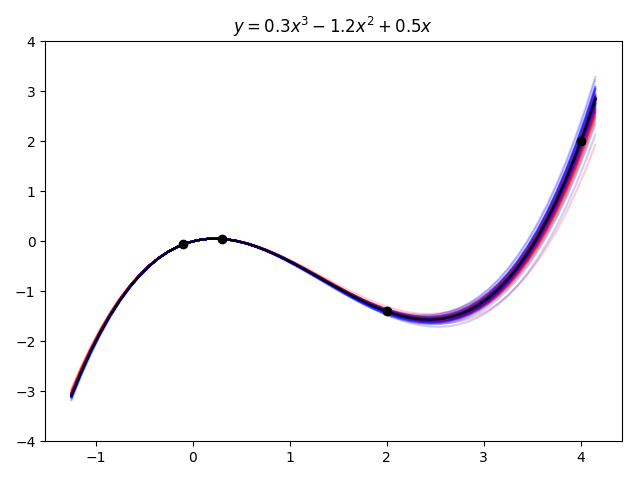
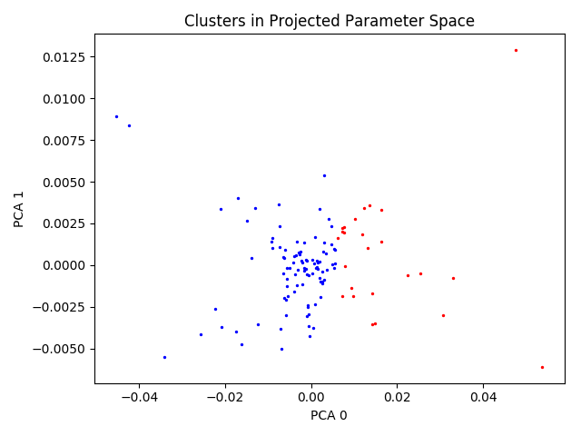

# mobo

## Introduction
`mobo` is an algorithm to solve multi-objective problems without imposing the bias of weights. Rather than converging to a single 'optimal' solution, `mobo` produces an ensamble of rational solutions which may then be further downselected according to the constraints of a particular application.

## Installation
`mobo` can be installed simply with pip. 
```bash
$ python3 -m pip install mobo
```
For testing or development you will need to clone the repo.
```bash
$ git clone https://github.com/seatonullberg/mobo.git
```

## Example
An introductory example, fitting a polynomial, is available in the [examples directory](./examples). Snippets of that example will be shown here. The first step in preparing an optimizer is to define the parameters which are being optimized.
```python
parameters = [
        Parameter("a", -1.0, 1.0), 
        Parameter("b", -2.0, 0.0),
        Parameter("c", 0.0, 1.0)
]
```
Each parameter has a name, a lower bound, and an upper bound. Next, it is necessary to define the quantities of interest which will be evaluated with the fitted parameters.
```python
qois = [
        QoI("pt0", evaluate_pt0, -0.062),
        QoI("pt1", evaluate_pt1, 0.05),
        QoI("pt2", evaluate_pt2, -1.4),
        QoI("pt3", evaluate_pt3, 2.0)
]
```
Each quantity of interest has a name, an associated evaluation function, and a target value. The evaluation function should take only a dict mapping parameter names to their values as its argument and return a float.
```python
# target coefficients: 0.3, -1.2, 0.5
polynomial = lambda a, b, c, x: a*x**3 + b*x**2 + c*x

# target: -0.062
def evaluate_pt0(params):
    x = -0.1
    return polynomial(params["a"], params["b"], params["c"], x)
```
After these fundamental components are defined, the mobo-centric components should be chosen.
```python
clusterer = KmeansClusterer(n_clusters=2)
error_calculator = SquaredErrorCalculator()
filters = [ParetoFilter(), PercentileFilter()]
projector = PCAProjector()
```
A clusterer is required to partition the parameter space, an error calculator is required to determine a cost, filters are used to purge poor parameterizations, and a projector is used to project a high dimensional parameter space down to 2D for more effective clustering. Since this algorithm is iterative, each iteration requires a 'local' configuration which is passed into a 'global' configuration before finally constructing the optimizer.
```python
local_config = LocalConfiguration(
    n_samples, clusterer, error_calculator, filters, projector
)
local_configurations = [local_config for _ in range(n_iterations)]
global_config = GlobalConfiguration(
    n_samples, n_iterations, local_configurations, parameters, qois
)
```
Once the global configuration has been constructed, execution of the optimizer is trivial.
```python
optimizer = Optimizer(global_config)    
optimizer()
```
As an aside, you may notice that this optimizer is a callable object. I use this theme in many objects which only expose publicly a single method. After optimization you will be left with some data files representing the results of each iteration. If you were to visualize the final results, you should see something like this.



The black line is the target polynomial, the black dots are the points used as quantities of interest, the blue lines are the predictions from cluster 0 and the red lines are predictions from cluster 1. As you can see, the fit is quite close. Other choices of points to evaluate should yield similar results so long as they are near the local extrema. The following plot attempts to illustrate some of the internal mechanics.



The points are parameters projected down onto their primary PCA vectors. Blue points correspond to parameterizations from cluster 0 and red from cluster 1. This view is essentially what the KDE sampler "sees" when it is selecting new parameterizations. This view helps to show why the parameters in different clusters are producing distinct predictions.

## Algorithm Description
TODO

## Acknowledgements
The implementation of this algorithm is based upon work I contributed to in [pypospack](https://github.com/eragasa/pypospack). The `pypospack` project is the focus of [this dissertation](http://phillpot.mse.ufl.edu/wp-content/uploads/2019/08/2019_Ragasa_Dissertation.pdf) which you may be interested in reading for a more in-depth description of the mathematics involved or alternative applications of the algorithm. 
